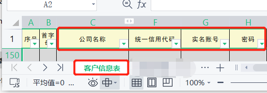

# gd-tax-plugin
[中文说明](README.md)

## What?
A guangdong.chinatax.gov.cn plugin (Base on TamperMonkey)

## Why?
Developed for the financial accountant's wife to reduce her workload.

## How?
### 1. Install TamperMonkey（360/EDGE/Chrome...）
Serach by yourself.(For Chinese friends, it is recommended to use the edge browser).

### 2. Install plugin
https://greasyfork.org/scripts/443095-gd-tax-plugin/code/gd-tax-plugin.user.js

# :warning: excel data format
- sheet：客户信息表
- title：公司名称，统一信用代码，实名账号，密码

## Todo
- [X] Skip the notification box and switch to the password login interface.
- [X] Copy the login information in excel, then paste the auto-parse fill in the login box.
- [X] Store the login information in excel to the browser database, and search directly in the browser without opening excel.
- [X] After logging in, common icons are displayed on the home page, and each customer does not need to add them.

# License
[MIT © GREENYvY](./LICENSE)